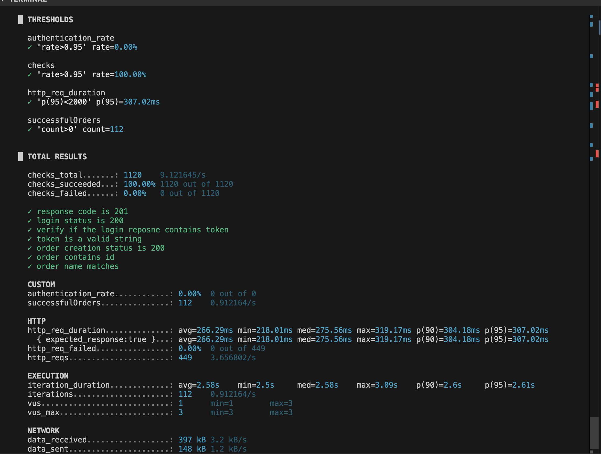
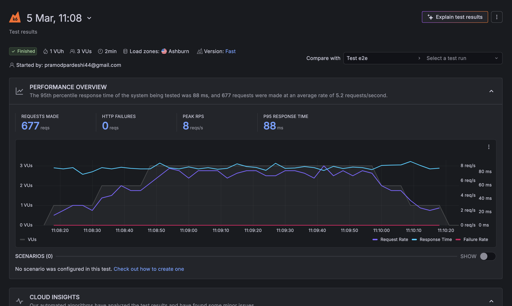

# 🚀 k6 Load Testing with Grafana Cloud

This project demonstrates performance testing using **k6 integrated with Grafana Cloud**.  
It supports multiple testing strategies like **smoke testing, load testing, stress testing, and spike testing**.

---

## 📌 Features

- Smoke Testing
- Load Testing
- Stress Testing
- Spike Testing
- Distributed Cloud Execution
- CI/CD ready (Jenkins compatible)

---

## 📂 Project Structure

```
k6-load-testing-grafana
│
├── configs
│   └── test-configs.json
│
├── data
│   └── users.json
│
├── scripts
│   ├── e2e.js
│   ├── e2e-optimized.js
│
├── package.json
└── README.md
```

---

## ▶️ Run Test Locally

```
k6 run scripts/e2e-optimized.js
```

---

## ☁️ Run Test using Grafana Cloud

```
k6 cloud login --token <your-token>
k6 cloud run scripts/e2e-optimized.js -e TEST_TYPE=smoke
```

---
## 📊 k6 Test Execution Output

Example output after running the performance test locally.



## 📈 Grafana Cloud Dashboard

Grafana dashboard visualizing performance metrics such as:

- Response Time
- Request Rate
- Failure Rate
- Virtual Users



---

## 🛠 Tech Stack

- k6
- Grafana Cloud
- JavaScript
- Jenkins

---

## 👨‍💻 Author

Pramod Pardeshi  
https://github.com/pramod-sdet/k6-load-testing-grafana

SDET | Automation | Performance Testing
